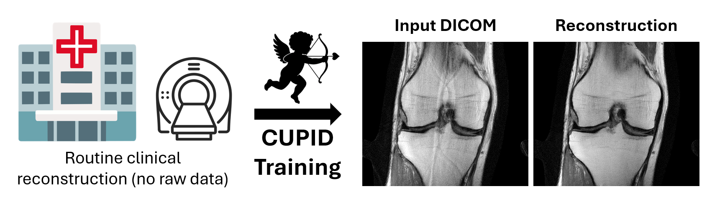

# CUPID [NeurIPS '25 Spotlight]
[](https://arxiv.org/pdf/2411.13022)
[](https://neurips.cc/virtual/2025/loc/san-diego/poster/115476)

<p align="center">
  
</p>

> **Fast MRI for All: Bridging Access Gaps by Training without Raw Data**<br>
> [Yasar Utku Alcalar](https://utkualcalar.github.io/), Merve Gulle, [Mehmet Akcakaya](https://imagine.umn.edu/people/mehmet-akcakaya) <br>
> Neural Information Processing Systems (NeurIPS) 2025
> 
>**Summary**: <br>
>CUPID is a physics-driven deep learning (PD-DL) approach for fast MRI reconstruction that enables high-quality model training using only routine clinical images, **without access to raw k-space data**, making advanced MRI reconstruction more accessible outside specialized centers.
>
> ## 📝 Citation
```bibtex

@inproceedings{alcalar2025cupid,
    title     = {Fast {MRI} for All: Bridging Access Gaps by Training without Raw Data},
    author    = {Yasar Utku Alcalar and Merve Gulle and Mehmet Akcakaya},
    booktitle = {The Thirty-ninth Annual Conference on Neural Information Processing Systems},
    year      = {2025}
    url       = {https://openreview.net/forum?id=ugBmWX3H1R}
    }
```
