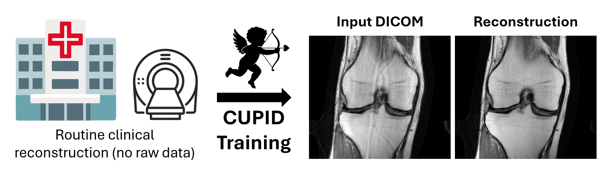

# CUPID [NeurIPS '25 Spotlight]
[](https://arxiv.org/pdf/2411.13022)
[](https://neurips.cc/virtual/2025/loc/san-diego/poster/115476)

<p align="center">
  
</p>

> **Fast MRI for All: Bridging Access Gaps by Training without Raw Data**<br>
> [Yasar Utku Alcalar](https://utkualcalar.github.io/), [Merve Gulle](https://scholar.google.com/citations?user=Pmu-yJYAAAAJ&hl=en), [Mehmet Akcakaya](https://imagine.umn.edu/people/mehmet-akcakaya) <br>
> Neural Information Processing Systems (NeurIPS) 2025
> 
>**Summary**: <br>
>CUPID is a physics-driven deep learning (PD-DL) approach for fast MRI reconstruction that enables high-quality model training using only routine clinical images, **without access to raw k-space data**, making advanced MRI reconstruction more accessible outside specialized centers.

## 📁 Project Structure

```bash
CUPID/
├── configs/                       # YAML configuration files
│   ├── data_config.yaml           # Dataset & loader settings
│   ├── model_config.yaml          # Model architecture & hyperparameters
│   └── sparsity_config.yaml       # Sparsity priors / regularization settings
│
├── data/                          # Example datasets or user-provided inputs
│   ├── ...
│   └── README.md
│
├── pytorch_wavelets/              # Third-party dependency (not modified)
│
├── scripts/
│   └── train_CUPID_retro.sh       # Shell script to launch retrospective zero-shot training
│
├── src/
│   ├── data/
│   │   ├── loader.py              # Dataset + dataloader utilities
│   │   └── mri_ops.py             # MRI operators (CG, E_Omega, FFT, etc.)
│   │
│   ├── models/
│   │   ├── compressed_sensing.py  # Baseline CS reconstruction
│   │   ├── data_consistency.py    # DC layers for PD-DL pipeline
│   │   ├── resnet.py              # Residual CNN backbone
│   │   └── unrolled_net.py        # Main unrolled network architecture
│   │
│   ├── util/
│   │   ├── eval_utils.py          # Metrics: PSNR, SSIM, and visualization tools
│   │   └── sparsity_utils.py      # Compressibility loss functions
│   │
│   ├── perturbations.py           # Perturbation definitions
│   └── train.py                   # Training loop for CUPID
│
├── LICENSE
├── README.md
└── requirements.txt
```

## Setup

### 1. Create Conda Environment and Install Requirements
```bash
conda env create -n cupid python=3.12 -y
conda activate cupid

cd CUPID
pip install requirement.txt
```

### 2. External Libraries
CUPID relies on advanced wavelet transforms (2D DWT/DCTWT) implemented in the `pytorch_wavelets` library. Clone it into your workspace:
```
git clone https://github.com/fbcotter/pytorch_wavelets
```

### 3. Data Preparation
In our retrospective experiments, we used the [fastMRI](https://fastmri.med.nyu.edu/) dataset, acquired with relevant institutional review board approvals. More information regarding this is included in `data/README.md`.

### 4. Zero-Shot Experiments
Once the environment is configured and data is prepared, run zero-shot training and evaluation:
```
bash scripts/train_CUPID_retro.sh
```
The script performs retrospective training using default hyperparameters. Configurations can be customized by modifying YAML files in `configs/` or adjusting shell scripts in `scripts/`.

## 📝 Citation
If you find CUPID useful in your research, please cite:
```bibtex
@inproceedings{alcalar2025cupid,
    title     = {Fast {MRI} for All: Bridging Access Gaps by Training without Raw Data},
    author    = {Yasar Utku Alcalar and Merve Gulle and Mehmet Akcakaya},
    booktitle = {The Thirty-ninth Annual Conference on Neural Information Processing Systems},
    year      = {2025}
    url       = {https://openreview.net/forum?id=ugBmWX3H1R}
    }
```

## Copyright & License Notice
© 2025 Regents of the University of Minnesota — For more details, please see `LICENSE`.
